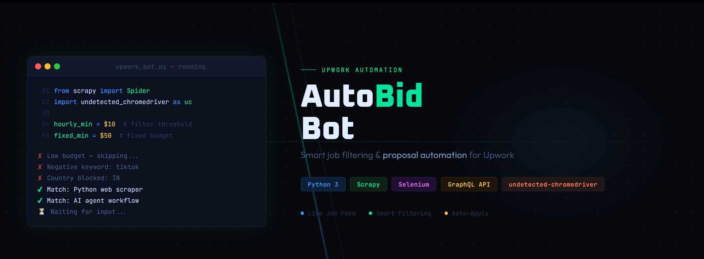

# Upwork Job Alert & Auto-Apply Bot



Automates the process of finding, filtering, and applying to relevant Upwork jobs in near real-time.

## Overview

This bot continuously monitors Upwork job listings using their internal GraphQL API, applies custom filters to identify high-quality opportunities, and partially automates the proposal submission process using Selenium.

Built for freelancers who want to:
- Skip low-quality jobs
- Get instant alerts on relevant postings
- Apply faster than competitors

---

## Features

- Real-time job scraping via Upwork API
- Advanced filtering system:
  - Budget thresholds (hourly & fixed)
  - Client spend & hiring history
  - Client rating & feedback
  - Payment verification
  - Country filtering
  - Keyword-based filtering (title, description, skills)
- Automatic proposal filling (cover letter + budget)
- Notification sound for new opportunities
- Duplicate job prevention (tracked via file)
- Manual review before final submission (safety layer)

---

## How It Works

1. Logs into Upwork using Selenium
2. Continuously fetches latest jobs via API
3. Applies filtering rules
4. Opens valid jobs in browser
5. Auto-fills proposal details:
   - Budget
   - Cover letter
6. Alerts user with sound
7. Waits for manual confirmation before proceeding

---

## Project Structure

```
.
├── upworkAlert_v2.py        # Main bot script
├── config.py                # All thresholds, credentials, settings
├── cover_letter.txt        # Your proposal template
├── processed_jobs.txt      # Stores already processed job IDs
├── notification.wav        # Alert sound
```

---

## Setup

### 1. Install Dependencies

```bash
pip install scrapy selenium undetected-chromedriver pyaudio rich
```

---

### 2. Configure `config.py`

Set the following:

- Upwork credentials
- Budget thresholds
- Client filters
- Negative keywords
- File paths

Example:

```python
UPWORK_EMAIL = "your_email"
UPWORK_PASSWORD = "your_password"

HOURLY_BUDGET_MIN_THRESHOLD = 10
FIXED_BUDGET_THRESHOLD = 100

NEGATIVE_KEYWORDS = ["wordpress", "data entry"]
NEGATIVE_COUNTRIES = ["india", "bangladesh"]
```

---

### 3. Add Required Files

- `cover_letter.txt` → your proposal template
- `processed_jobs.txt` → empty file initially
- `notification.wav` → any alert sound

---

### 4. Run the Bot

```bash
python upworkAlert_v2.py
```

---

## Key Logic

### Filtering Pipeline

Each job must pass:

- Title check (no negative keywords)
- Description check
- Skills check
- Client country check
- Payment verification
- Budget threshold
- Client rating
- Average spend per hire

If any fails → job skipped instantly.

---

### Budget Strategy

- Fixed jobs → auto-adjusts bid (20% lower)
- Hourly jobs → uses client range

---

### Safety Mechanism

Before final submission:
- Bot pauses
- User reviews proposal
- Manual confirmation required

---

## Notes

- Uses `undetected_chromedriver` to reduce detection risk
- Runs in infinite loop with sleep interval
- Keeps browser session alive
- Avoids reprocessing same jobs

---

## Limitations

- Dependent on Upwork internal API (can break anytime)
- Requires active browser session
- CAPTCHA or security checks may interrupt flow
- Not fully headless

---

## Legal & Risk Consideration

Automating interactions on Upwork may violate their Terms of Service. Use at your own risk. Account restrictions or bans are possible.

---

## Possible Improvements

- Proxy rotation
- CAPTCHA solving integration
- AI-generated cover letters
- Telegram/Slack notifications
- Multi-account scaling
- Smart bidding strategy

---

## Author

Talha – Python Web Scraper & Automation Specialist
